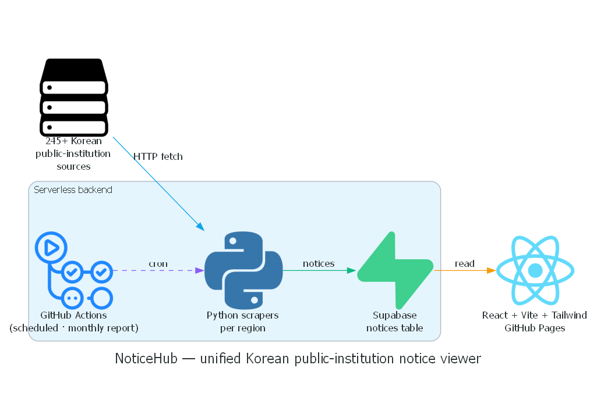

# NoticeHub

Unified viewer for **Korean public-institution announcements (공지사항)**. Scheduled
scrapers pull notices from **245+ public-institution websites** into a Supabase
table, and a React + Vite + Tailwind UI lets you browse them by region. Hosted on
GitHub Pages — fully serverless and free to run.

**🌐 Live:** <https://kh1606.github.io/noticehub/>

**Stack:** React · Vite · Tailwind · Supabase · GitHub Actions · GitHub Pages



*Rendered from [`docs/howitworks.py`](docs/howitworks.py) (Python `diagrams` library).*

## How it fits together

- **Scrapers** (`scrapers/`) — one Python script per region; runs on a GitHub
  Actions cron, upserts notices into Supabase.
- **`monthly_report.yml`** — monthly aggregate report job (GitHub Actions).
- **Supabase** — single `notices` table; the front-end reads it directly.
- **React + Vite + Tailwind** — browse + filter UI, deployed to GitHub Pages.
- **Admin** — `src/components/admin/` (login behind Supabase auth) for source
  management.

## Run

```bash
# front-end
npm install
npm run dev          # http://localhost:5173 (needs Supabase env in .env)

# scrapers (locally)
pip install -r scrapers/requirements.txt
python scrapers/<region>.py
```
